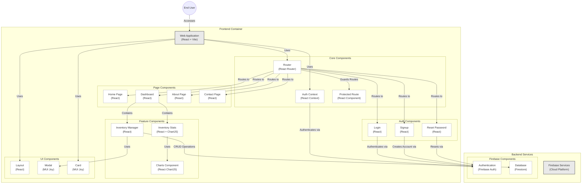

```mermaid
graph TB
    User((End User))

    subgraph "Frontend Container"
        WebApp["Web Application<br>(React + Vite)"]
        
        subgraph "Core Components"
            Router["Router<br>(React Router)"]
            AuthContext["Auth Context<br>(React Context)"]
            ProtectedRoute["Protected Route<br>(React Component)"]
        end

        subgraph "Page Components"
            Home["Home Page<br>(React)"]
            Dashboard["Dashboard<br>(React)"]
            About["About Page<br>(React)"]
            Contact["Contact Page<br>(React)"]
        end

        subgraph "Feature Components"
            InventoryManager["Inventory Manager<br>(React)"]
            InventoryStats["Inventory Stats<br>(React + ChartJS)"]
            Charts["Charts Component<br>(React ChartJS)"]
        end

        subgraph "Auth Components"
            Login["Login<br>(React)"]
            Signup["Signup<br>(React)"]
            ResetPassword["Reset Password<br>(React)"]
        end

        subgraph "UI Components"
            Layout["Layout<br>(React)"]
            Modal["Modal<br>(MUI Joy)"]
            Card["Card<br>(MUI Joy)"]
        end
    end

    subgraph "Backend Services"
        Firebase["Firebase Services<br>(Cloud Platform)"]
        
        subgraph "Firebase Components"
            Auth["Authentication<br>(Firebase Auth)"]
            Firestore["Database<br>(Firestore)"]
        end
    end

    %% User Interactions
    User -->|"Accesses"| WebApp
    
    %% Frontend Component Relations
    WebApp -->|"Uses"| Router
    WebApp -->|"Uses"| AuthContext
    Router -->|"Guards Routes"| ProtectedRoute
    
    %% Page Component Relations
    Router -->|"Routes to"| Home
    Router -->|"Routes to"| Dashboard
    Router -->|"Routes to"| About
    Router -->|"Routes to"| Contact
    
    %% Feature Component Relations
    Dashboard -->|"Contains"| InventoryManager
    Dashboard -->|"Contains"| InventoryStats
    InventoryStats -->|"Uses"| Charts
    
    %% Auth Component Relations
    Router -->|"Routes to"| Login
    Router -->|"Routes to"| Signup
    Router -->|"Routes to"| ResetPassword
    
    %% UI Component Usage
    WebApp -->|"Uses"| Layout
    InventoryManager -->|"Uses"| Modal
    WebApp -->|"Uses"| Card
    
    %% Backend Integration
    AuthContext -->|"Authenticates via"| Auth
    InventoryManager -->|"CRUD Operations"| Firestore
    Login -->|"Authenticates via"| Auth
    Signup -->|"Creates Account via"| Auth
    ResetPassword -->|"Resets via"| Auth

    %% Styling
    classDef container fill:#e9e9e9,stroke:#666,stroke-width:2px
    classDef component fill:#fff,stroke:#999,stroke-width:1px
    class WebApp,Firebase container
    class Router,AuthContext,ProtectedRoute,Home,Dashboard,About,Contact,InventoryManager,InventoryStats,Charts,Login,Signup,ResetPassword,Layout,Modal,Card,Auth,Firestore component
```
